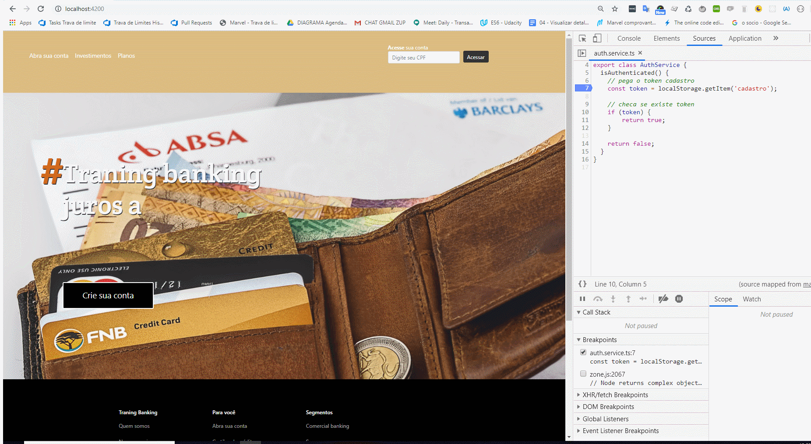

# Internet Bank

Este projeto foi gerado com [Angular CLI] (https://github.com/angular/angular-cli) versão 6.0.8.

## Servidor de desenvolvimento

Execute `ng serve` para um servidor de desenvolvimento. Navegue até `http: // localhost: 4200 /`. O aplicativo será recarregado automaticamente se você alterar qualquer um dos arquivos de origem.

## Code scaffolding

Execute `ng generate component-name` para gerar um novo componente. Você também pode usar `ng generate Directive | pipe | service | class | guard | interface | enum | module`.

## Construção

Execute `ng build` para construir o projeto. Os artefatos de construção serão armazenados no diretório `dist /`. Use o sinalizador `--prod` para uma construção de produção.

## Executando testes de unidade

Execute `ng test` para executar os testes de unidade via [Karma] (https://karma-runner.github.io).

## Executando testes ponta a ponta

Execute `ng e2e` para executar os testes de ponta a ponta via [Protractor] (http://www.protractortest.org/).

## Ajuda adicional

Para obter mais ajuda sobre o Angular CLI, use `ng help` ou verifique o [Angular CLI README] (https://github.com/angular/angular-cli/blob/master/README.md).

## O desafio
1) Crie no mínimo 3 componentes que deverão estar interagindo na mesma página (Não esqueça das rotas):
Os prinicpais components utilizados no Internet Banking foram:
- Header
- Content
- Footer

2) Escolha no mínimo 4 componentes do Angular Material e incorpore eles em sua aplicação:
Feito com o BrowserAnimationsModule 

3) Crie em uma das páginas uma interação através da Interpolação e/ou utilizando Property Biding:
Feito

4) Crie uma explicação sobre o que foi feito, esta explicação será inserida na plataforma junto com o link para o código no GitHub: 
Feito na própria plataforma da DIO

## Conclusão

Um projeto inicial em Angular, onde foi possível desenvolver vários conceitos de desenvolvimento Front_End como Injeção de Dependência, Data Binding, Rotas, Modularização, entre outros e familiarizar com módulos já prontos, como o Angular Material que ampliam e muito o poder do desenvolvedor.